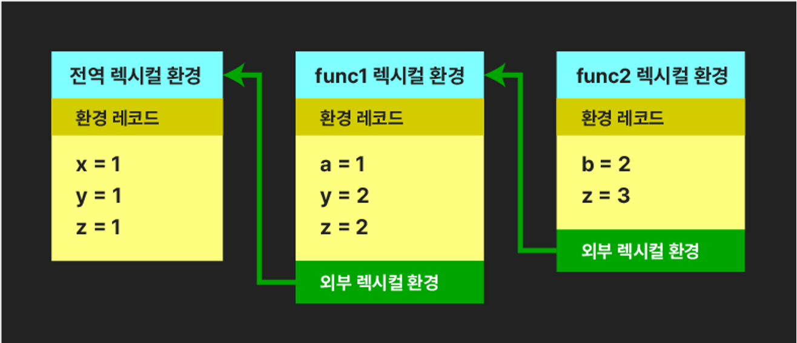
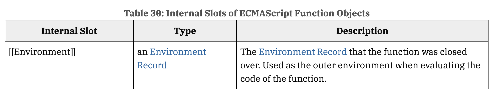

# 서론

클로저는 많은 개발자들이 자바스크립트를 배우는 과정에서 가장 어렵고 복잡하다고 느끼는 개념 중 하나입니다. 자바스크립트의 동작 원리와 스코프 체인을 깊이 이해해야 하기 때문에 초보자에게는 혼란을 야기할 수 있습니다. 클로저는 함수 내부에서 외부 함수의 변수를 참조할 수 있는 능력을 제공하는 메커니즘으로, 자바스크립트의 비동기 처리나 콜백 함수에서 자주 등장하며 중요한 역할을 합니다.

그러나 클로저는 단순히 자바스크립트의 어려운 개념에 그치지 않습니다. 이는 함수형 프로그래밍의 기본 개념 중 하나로 널리 사용됩니다. 함수형 프로그래밍은 상태 변화와 부작용을 최소화하는 프로그래밍 패러다임인데, 클로저는 함수 내에서 상태를 유지하고 캡슐화하는 데 탁월한 역할을 합니다. 클로저를 이해함으로써 함수형 프로그래밍의 장점을 더욱 깊이 활용할 수 있으며, 코드의 재사용성과 유지보수성을 높일 수 있습니다.

따라서 클로저는 자바스크립트의 강력한 도구일 뿐만 아니라, 함수형 프로그래밍을 이해하는 데 필수적인 요소입니다. 이 글에서는 클로저의 개념, 작동 원리, 활용 방법을 차근차근 살펴보고, 이를 실무에서 어떻게 효과적으로 사용할 수 있는지 알아보겠습니다.

<br />

# **1. 클로저의 정의**

## **1-1. 클로저란 무엇인가?**

클로저는 **함수와 그 함수가 선언된 렉시컬 환경의 조합**을 의미합니다. 쉽게 말해, 클로저는 함수가 선언될 당시의 외부 스코프에 접근할 수 있는 함수입니다.

자바스크립트에서는 함수가 선언될 때 해당 함수의 렉시컬 환경을 기억합니다. 이로 인해 외부 함수가 종료된 후에도 내부 함수가 외부 변수에 접근할 수 있게 되는 메커니즘을 의미합니다.

여기서 **렉시컬 환경**과 **외부 스코프**라는 용어가 생소할 수 있습니다. 이 개념들은 자바스크립트의 스코프와 변수 관리 방식과 밀접하게 연관되어 있습니다. 이를 이해하면 클로저에 대해서 더욱 쉽게 파악할 수 있을 것입니다.

<br />

# **2. 클로저를 이해하기 위한 사전 지식**

## **2-1. 렉시컬 환경**



**렉시컬(Lexical)**이란 단어는 사전적으로 ‘어휘적' 또는 '문맥적'이라는 의미를 지닙니다. 이를 바탕으로 자바스크립트에서 렉시컬 환경을 이해하면, **함수가 선언될 당시의 문맥을 기억하는 환경**이라고 할 수 있습니다.

렉시컬 환경은 함수가 실행될 때 해당 함수의 스코프 내 변수와 함수 정보를 포함하는 객체입니다. 쉽게 말해, **함수가 실행될 때 그 함수 안에서 사용할 수 있는 변수들과 함수들을 저장하는 공간**입니다. 자바스크립트 엔진은 렉시컬 환경을 통해 함수가 어떤 변수를 참조하는지 관리합니다. 주목할 점은 자바스크립트 함수가 선언되는 순간, 그 주변의 스코프 정보를 함께 기억한다는 것입니다. 이렇게 기억된 정보는 함수가 나중에 실행될 때도 그대로 유지되어, 함수가 언제 어디서 실행되더라도 해당 변수를 참조할 수 있게 됩니다.

여기서 렉시컬 환경은 두 가지 중요한 부분으로 나눌 수 있습니다.

### **환경 레코드**

환경 레코드는 함수가 선언되었을 때 존재하는 변수, 상수, 함수 등의 정보를 저장하는 객체입니다. 현재 스코프 내에서 사용할 수 있는 모든 식별자를 기록하고 관리합니다.

예를 들어, 함수 내부에서 `let x = 10;` 이 선언되었다면, 렉시컬 환경의 환경 레코드에는 `x = 10` 이라는 정보가 저장됩니다.

### **외부 렉시컬 환경 참조**

외부 렉시컬 환경 참조는 함수가 선언된 위치에서 상위 스코프에 대한 참조 정보를 담고 있습니다. 이 정보를 통해 현재 함수가 선언된 스코프보다 상위에 있는 스코프에서 선언된 변수에 접근할 수 있게 됩니다. 이 참조는 스코프 체인을 형성하여, 함수가 현재 스코프에서 변수를 찾지 못했을 때 상위 스코프까지 계속해서 변수를 찾아갈 수 있게 해줍니다.

이때 자바스크립트는 함수가 어디서 선언되었는지에 따라 상위 스코프를 결정하는 렉시컬 스코핑 방식을 사용합니다.

## **2-2. 렉시컬 스코프**

자바스크립트의 렉시컬 스코프는 **변수나 함수가 선언된 위치에 따라 그 변수를 참조할 수 있는 범위가 결정되는 규칙**을 말합니다. 자바스크립트는 렉시컬 스코핑 방식을 따르기 때문에, **함수가 어디서 호출되었는지가 아니라, 어디서 선언되었는지에 따라** 그 함수가 접근할 수 있는 변수가 결정됩니다.

다음과 같은 예시를 살펴 봅시다.

```jsx
const x = 1;

function 외부함수() {
  const x = 10;
  내부함수();
}

function 내부함수() {
  console.log(x);
}

외부함수(); // 1 출력
내부함수(); // 1 출력
```

위의 예시에서 ‘외부함수’와 ‘내부함수’는 모두 1을 출력합니다. ‘외부함수’ 내에서 ‘내부함수’가 호출되므로, ‘내부함수’가 ‘외부함수’ 내의 `x = 10` 을 참조하여 10을 출력할 것이라고 예상할 수 있습니다. 하지만 ‘내부함수’는 자신이 선언된 위치의 스코프를 참조합니다. ‘내부함수’는 전역에서 선언되었기 때문에 전역 스코프의 `x = 1` 을 참조하여 1을 출력합니다. 따라서 ‘외부함수’ 내의 지역 변수 `x = 10` 은 무시됩니다.

마찬가지로 ‘내부함수’를 직접 호출할 때도 전역 스코프에서 `x = 1` 을 찾아 1을 출력합니다.

이는 함수의 상위 스코프가 렉시컬 스코핑 방식을 따라 **함수가 정의된 위치에 따라 정적으로 결정**되기 때문입니다. 함수가 어디서 호출되는지와 관계없이, 함수는 선언된 시점의 스코프에서 변수를 참조합니다.

<br />

# **3. 클로저의 기본 동작 원리**

## **3-1. 클로저 생성 과정**

클로저는 **함수와 그 함수가 선언된 렉시컬 환경의 조합**을 의미합니다.



구체적으로 설명하면, 자바스크립트에서 함수가 선언될 때, 그 함수는 내부적으로 [[Environment]] 라는 내부 슬롯에 렉시컬 환경에 대한 참조를 함께 저장합니다. 이 [[Environment]] 내부 슬롯은 함수 외부에 있는 변수들이 포함되며, 함수가 나중에 호출되더라도 해당 함수가 선언될 당시의 외부 렉시컬 환경에 접근할 수 있는 참조를 유지하게 됩니다.

함수가 나중에 호출되더라도, [[Environment]] 내부 슬롯에 저장된 렉시컬 환경의 참조를 통해 해당 함수가 선언될 당시의 외부 렉시컬 환경에 접근할 수 있게 됩니다. 이러한 메커니즘 덕분에 함수는 외부 함수의 변수를 기억하고 접근할 수 있으며, 이러한 함수와 환경의 조합이 바로 **클로저**입니다.

클로저는 함수가 호출될 때, 선언된 시점의 외부 변수를 계속해서 참조할 수 있도록 함으로써 상태를 유지하거나 데이터를 은닉할 수 있게 합니다. 이는 함수가 종료된 이후에도 [[Environment]] 내부 슬롯에 저장된 렉시컬 환경이 메모리에 유지되기 때문에 가능합니다.

## **3-2. 함수 실행 시 클로저의 메모리 관리와 상태 유지**

클로저의 주요 특징 중 하나는 **외부 함수가 종료된 후에도 외부 함수의 변수를 메모리에서 유지**할 수 있다는 점입니다. 일반적으로 자바스크립트에서 함수가 실행되고 종료되면, 해당 함수 내에서 선언된 지역 변수들은 더 이상 참조되지 않는다면 가비지 컬렉터에 의해 메모리에서 해제됩니다. 이는 메모리 누수를 방지하고 효율적인 메모리 관리를 위해 필수적인 과정입니다.

그러나 클로저를 사용하면 상황이 달라집니다. 클로저는 함수가 선언될 때의 렉시컬 환경을 기억하고, 함수의 [[Environment]] 내부 슬롯을 통해 해당 환경에 대한 참조를 유지합니다. 이로 인해 외부 함수가 종료된 이후에도 내부 함수는 외부 함수의 변수들에 계속해서 접근할 수 있습니다.

자바스크립트 엔진은 클로저가 외부 변수에 대한 참조를 가지고 있는지 여부를 확인하여, 해당 변수를 메모리에서 해제하지 않고 유지합니다. 따라서 클로저는 외부 함수의 변수를 메모리에 계속 남겨두어 상태를 유지하거나 데이터를 은닉하는 데 활용됩니다.

<br />

# **4. 클로저의 기본 예시**

```jsx
function 케이크상자() {
  let 케이크수 = 0;

  const 케이크먹기 = function () {
    케이크수++;
    return `케이크를 ${케이크수}개 먹었어요!`;
  };

  return 케이크먹기;
}

const 케이크 = 케이크상자();

console.log(케이크()); // 케이크를 1개 먹었어요!
console.log(케이크()); // 케이크를 2개 먹었어요!
```

해당 코드는 클로저의 개념을 잘 보여주는 기본적인 예시입니다.

'케이크상자' 함수는 '케이크수' 변수를 정의하고 있습니다. 이 변수는 '**케이크상자' 함수 내에서만 유효한 지역 변수**지만, **내부 함수인 '케이크먹기' 함수에서 참조됩니다**. '케이크먹기' 함수는 외부 함수가 종료된 후에도 '케이크수' 변수에 접근할 수 있는데, 이를 가능케 하는 것이 바로 클로저입니다.

‘케이크상자’ 함수가 호출되면 내부 함수 ‘케이크먹기’ 함수가 반환됩니다. 이때 ‘케이크먹기’ 함수는 클로저가 되어 ‘케이크수’ 변수를 계속 참조하고, 외부 함수 종료 후에도 ‘케이크수’ 변수의 상태를 유지합니다. ‘케이크먹기’ 함수는 내부 [[Environment]] 슬롯에 ‘케이크상자’ 함수의 렉시컬 환경을 저장하여 ‘케이크수’ 변수의 값을 유지하고 증가시키며, 호출될 때마다 변경된 값을 반환합니다.

따라서 ‘케이크먹기’ 함수는 ‘케이크수’ 변수를 계속 기억할 수 있습니다. 첫 번째 호출 시 ‘케이크수’를 1로, 두 번째 호출 시에는 2로 증가시킵니다. 이렇게 **클로저에 의해 변수가 메모리에 유지되어 상태가 누적됩니다.**

<br />

# **5. 자바스크립트의 클로저**

자바스크립트에서 모든 함수는 **이론적으로 클로저입니다.** 이는 자바스크립트의 함수가 렉시컬 스코프를 따르기 때문에 자신이 선언된 스코프에 있는 변수를 기억하고 참조할 수 있기 때문입니다.

그러나 **실질적으로 모든 함수가 클로저로 동작하지는 않습니다**. 클로저는 함수가 상위 스코프에 선언된 변수를 참조할 때만 생성됩니다. 다시 말해, 내부 함수가 상위 스코프의 변수에 접근할 필요가 없거나 접근하지 않는다면, 그 함수는 클로저로 작동하지 않습니다.

## **5-1. 클로저가 아닌 사례 (1) - 상위 스코프의 식별자를 참조하지 않는 경우**

만약 **함수가 상위 스코프의 변수를 전혀 참조하지 않으면, 그 함수는 클로저로 작동하지 않습니다.** 이 경우에는 함수는 독립적으로 동작하며, 외부 렉시컬 환경을 기억할 필요가 없습니다.

```jsx
function 음료수가게() {
  const 콜라 = '콜라를 주문했습니다.';
  const 사이다 = '사이다를 주문했습니다.';

  function 오늘의이벤트() {
    const 무료리필 = '사장님이 서비스로 한 잔 더 주셨습니다!'; // 내부 변수
    console.log(무료리필); // 내부 변수만 참조
  }

  return 오늘의이벤트;
}

const 음료수주문 = 음료수가게(); // 오늘의이벤트 함수를 반환
음료수주문(); // '사장님이 서비스로 한 잔 더 주셨습니다!' 출력
```

위 예시에서 ‘음료수가게’ 함수 내에서 ‘콜라’와 ‘사이다’라는 두 개의 변수가 선언되어 있지만, 이 변수들은 내부 함수인 ‘오늘의이벤트’에서 전혀 사용되지 않습니다. ‘오늘의이벤트’ 함수는 ‘무료리필’이라는 자신의 스코프에서만 정의된 변수를 참조하고 있습니다. 즉, 내부 함수가 외부 함수의 변수에 접근하지 않고, 자기 자신의 스코프 안에서만 변수를 관리합니다.

따라서, ‘오늘의이벤트’ 함수는 외부 함수의 변수를 전혀 사용하지 않기 때문에 클로저로 동작하지 않습니다.

상위 스코프의 식별자를 참조하지 않는 경우 클로저로 동작하지 않는 것은 자바스크립트 엔진의 최적화 전략과 밀접한 관련이 있습니다. 자바스크립트는 자동 메모리 관리를 수행하며, 가비지 컬렉션을 통해 더 이상 사용되지 않는 변수를 메모리에서 해제합니다. 함수 실행이 끝나면 함수 내부에서 선언된 지역 변수들은 더 이상 필요하지 않을 때 메모리에서 제거됩니다. 그러나 클로저가 생성되면 상위 스코프의 변수를 참조하는 내부 함수가 그 변수를 계속 참조하기 때문에, 자바스크립트 엔진은 그 변수를 메모리에 유지합니다.

함수가 외부 변수를 참조할 때만 메모리에 상위 스코프의 변수를 유지하면, 상위 스코프의 변수를 함수 실행이 끝난 후 즉시 메모리에서 해제할 수 있습니다. 클로저가 아닌 함수가 불필요하게 메모리 자원을 차지하지 않도록 함으로써, 메모리 사용을 줄이는 최적화를 수행합니다.

## **5-2. 클로저가 아닌 사례 (2) - 생명 주기가 외부 함수보다 짧은 경우**

클로저는 일반적으로 내부 함수가 외부 함수의 변수를 참조하고, 외부 함수가 종료된 후에도 내부 함수가 그 변수를 계속 사용할 수 있을 때 생성됩니다. 내부 함수의 생명 주기가 외부 함수보다 짧은 경우 클로저가 형성되지 않습니다.

```jsx
function 음료수가게() {
  const 콜라 = '콜라를 주문했습니다.';
  const 사이다 = '사이다를 주문했습니다.';

  function 오늘의이벤트() {
    console.log(콜라);
  }

  오늘의이벤트(); // 외부 함수가 종료되기 전에 바로 실행됨
}

음료수가게(); // 음료수가게 실행 후 모든 함수와 변수는 메모리에서 해제됨
```

위 예시에서 내부 함수인 ‘오늘의이벤트’ 함수는 외부 변수 ‘콜라’를 참조하지만, 외부 함수가 종료되기 전에 즉시 실행됩니다. 따라서 외부 함수가 종료되기 전, 외부 변수에 접근하여 값을 출력한 뒤 실행을 종료합니다.

‘오늘의이벤트’ 함수의 생명 주기는 외부 함수 ‘음료수가게’의 생명 주기보다 짧습니다. 내부 함수는 실행되는 동안 외부 렉시컬 환경에 접근하고 있지만, 그 이후 외부 함수가 종료되면서 모든 변수가 메모리에서 해제됩니다. 내부 함수가 외부 함수의 변수를 참조하는 것은 클로저의 핵심 조건 중 하나이지만, 외부 함수 종료 전에 모든 실행이 끝나므로 실질적으로 클로저가 아닙니다.

# **6. 클로저의 장단점**

## **6-1. 클로저의 장점**

클로저를 사용하면 외부에서 직접 접근할 수 없는 변수를 안전하게 보호하고, 해당 변수의 상태를 유지할 수 있습니다. 일반적으로 함수가 실행된 후, 함수 내부의 변수는 가비지 컬렉터에 의해 메모리에서 해제되지만, 클로저를 사용하면 내부 함수가 계속해서 상위 스코프의 변수를 참조할 수 있습니다. 이를 통해 변수의 상태를 지속적으로 유지할 수 있으며, 외부에서 직접 접근하거나 수정할 수 없으므로 데이터 은닉도 가능합니다.

또한, 클로저는 다양한 함수 설계 패턴을 구현하거나 비동기 작업을 처리하는 데도 중요한 역할을 합니다. 클로저를 통해 함수 팩토리 패턴이나 커링 기법과 같은 고급 설계 방식을 구현할 수 있고, 이벤트 핸들러나 비동기 요청을 처리할 때 특정 시점의 값을 저장하고 나중에 사용할 수 있습니다.

## **6-2. 클로저의 단점**

클로저는 상위 스코프의 변수를 참조하면서 메모리를 유지하기 때문에, 이를 잘못 관리하면 메모리 누수가 발생할 수 있습니다. 일반적인 함수는 실행이 끝나면 지역 변수가 메모리에서 해제되지만, 클로저는 참조가 유지되는 한 해당 변수를 메모리에 계속 보관합니다. 따라서 불필요하게 클로저를 남발하거나, 더 이상 필요하지 않은 클로저가 상위 스코프의 변수를 계속 참조하게 되면 가비지 컬렉션이 발생하지 않아 메모리 사용량이 증가할 수 있습니다. 이를 방지하려면 사용이 끝난 클로저에서 참조를 명시적으로 해제하는 등의 메모리 관리가 필요합니다.

클로저는 상태를 기억하고 유지하는 특성 때문에, 함수의 실행 흐름을 따라가거나 변수를 추적하는 과정에서 디버깅이 복잡해질 수 있습니다. 특히, 클로저가 여러 개 중첩되어 있을 경우, 상위 스코프의 변수 참조가 복잡해지며 어느 시점에서 상태가 변경되었는지를 파악하기 어려워질 수 있습니다. 클로저는 변수의 생명 주기를 예측하기 어려운 상황을 만들어, 디버깅 시점에서 의도한 값이 아닌 예상치 못한 변수 상태가 유지될 수 있습니다. 특히 비동기 처리나 콜백 함수에서 클로저를 사용할 때, 상태 관리의 복잡성이 디버깅을 더 어렵게 만들 수 있습니다.

<br />

# **7. 클로저의 활용 사례**

## **7-1. 데이터 은닉**

클로저는 **외부에서 직접 접근할 수 없는 변수를 안전하게 관리**하는 데 유용합니다. 이 기법을 통해 변수에 직접 접근하거나 수정하지 못하게 하여 데이터를 보호하고, 함수 내부에서만 값을 조작할 수 있게 합니다.

```jsx
function 은행계좌(초기잔액) {
  let 잔액 = 초기잔액; // 외부에서 접근할 수 없는 변수

  return {
    입금: function (금액) {
      잔액 += 금액;
      console.log(`입금 후 잔액: ${잔액}원`);
    },
    출금: function (금액) {
      if (금액 > 잔액) {
        console.log('잔액이 부족합니다.');
      } else {
        잔액 -= 금액;
        console.log(`출금 후 잔액: ${잔액}원`);
      }
    },
    잔액조회: function () {
      console.log(`현재 잔액: ${잔액}원`);
    },
  };
}

const 내계좌 = 은행계좌(10000);
내계좌.입금(5000); // 입금 후 잔액: 15000원
내계좌.출금(2000); // 출금 후 잔액: 13000원
내계좌.잔액조회(); // 현재 잔액: 13000원
```

위 예시에서 ‘잔액’ 변수는 클로저로 보호되며, 외부에서는 직접 접근할 수 없습니다.

‘은행계좌’ 함수가 ‘잔액’ 변수를 외부로부터 보호하고, 오직 반환된 메서드를 통해서만 이 변수를 조작할 수 있습니다. 클로저로 인해 ‘은행계좌’ 함수가 종료된 후에도 여전히 내부 함수에서 ‘잔액’ 변수를 참조할 수 있게 됩니다.

## **7-2. 커링**

커링은 여러 인자를 받는 함수를 분리하여 각 인자를 하나씩 받는 함수 체인으로 만드는 기법입니다. 이 과정에서 클로저가 중요한 역할을 합니다. 커링된 함수는 각 호출에서 인자를 클로저로 캡처하며, 이를 통해 나중에 필요한 연산을 수행할 수 있습니다.

```jsx
function 주문하기(커피종류) {
  return function (사이즈) {
    return function (추가옵션) {
      return `${커피종류}(${사이즈} 사이즈) 주문 완료! ${추가옵션} 추가 옵션이 선택되었습니다.`;
    };
  };
}

const 아메리카노주문 = 주문하기('아메리카노');
const 라지사이즈아메리카노 = 아메리카노주문('라지');

console.log(라지사이즈아메리카노('샷 추가'));
// 아메리카노(라지 사이즈) 주문 완료! 샷 추가 옵션이 선택되었습니다.
```

위 예시는 커피를 주문하는 함수를 분리하여 각 함수에서 커피의 세부 사항을 하나씩 선택하는 방식으로 구성되어 있습니다.

첫 번째 단계에서 `주문하기("아메리카노")` 를 통해 커피 종류를 선택합니다. 두 번째 단계인 `아메리카노주문("라지")` 는 사이즈를 선택하는 단계입니다. 마지막으로 `라지사이즈아메리카노("샷 추가")` 를 통해 추가 옵션을 선택하면 `아메리카노(라지 사이즈) 주문 완료! 샷 추가 옵션이 선택되었습니다.` 라는 문구가 출력됩니다.

이러한 커링의 장점은 **복잡한 함수 호출을 더 간결하고 단계별로 처리할 수 있게 해준다는 것**입니다. 커링을 사용하면 여러 인자를 한꺼번에 받는 대신, 각 인자를 하나씩 전달받아 필요한 시점에 함수 호출을 나눌 수 있습니다. 이를 통해 유연한 함수 호출이 가능해지며, 코드의 재사용성과 가독성을 높일 수 있습니다.

## **6-3. 리액트의 훅**

리액트의 훅은 함수형 컴포넌트에서 상태 관리 및 사이드 이펙트를 처리할 수 있게 해줍니다. 리액트 훅에서 클로저는 매우 중요한 역할을 합니다. 대표적으로 useState나 useEffect 훅에서 클로저는 이전 상태를 기억하고 안전하게 상태를 갱신할 수 있도록 도와줍니다.

```jsx
import { useState } from 'react';

function counter() {
  const [count, setCount] = useState(0); // count 상태 변수와 setCount 함수

  const increment = () => {
    setCount((prevCount) => prevCount + 1); // prevCount를 클로저로 기억하고, 상태를 안전하게 업데이트
  };

  return (
    <div>
      <p>현재 카운트: {count}</p>
      <button onClick={increment}>카운트 증가</button>
    </div>
  );
}
```

위 예시에서 useState 훅은 count라는 상태 변수를 관리합니다. setCount 함수는 클로저로 이전 상태 값인 prevCount을 기억하고, 이를 참조하여 새로운 상태 값을 계산합니다. 이렇게 하면 상태가 비동기적으로 업데이트되는 상황에서도 안전하게 상태를 관리할 수 있습니다. 이와 같이 리액트에서 클로저는 이전 상태 값을 유지하면서도 최신 상태로 안전하게 업데이트할 수 있는 메커니즘을 제공합니다.

<br />

# 결론

이번 글을 통해 클로저가 무엇인지, 그리고 그것이 자바스크립트에서 어떻게 동작하는지를 살펴보았습니다. 클로저는 자바스크립트에서 매우 강력한 기능으로, 상태 유지와 데이터 은닉, 함수 설계의 유연성 등을 제공하는 중요한 도구입니다. 하지만 클로저는 그 강력함만큼 주의해서 사용해야 합니다. 클로저가 불필요하게 사용되거나, 메모리 관리가 적절히 이루어지지 않을 경우 메모리 누수와 성능 저하를 초래할 수 있습니다.

따라서, 클로저는 필요한 상황에서만 적절히 활용되어야 하며, 이를 통해 얻는 이점과 성능 비용을 신중히 고려해야 합니다. 특히 대규모 애플리케이션에서는 클로저 사용을 신중하게 관리하고, 필요 없는 참조는 해제하는 등의 메모리 최적화가 필요합니다. 맹목적으로 클로저를 남발하지 말고, 그 특성과 장단점을 충분히 이해한 후에, 상황에 맞는 최적의 방법으로 사용해야만 클로저의 이점을 온전히 활용할 수 있을 것입니다.

<br />

# 참고 자료

- 모던 자바스크립트 Deep Dive : 자바스크립트의 기본 개념과 동작 원리
- https://www.yalco.kr/@javascript-abyss/12-1/
- https://tc39.es/ecma262/multipage/ordinary-and-exotic-objects-behaviours.html#sec-ecmascript-function-objects
